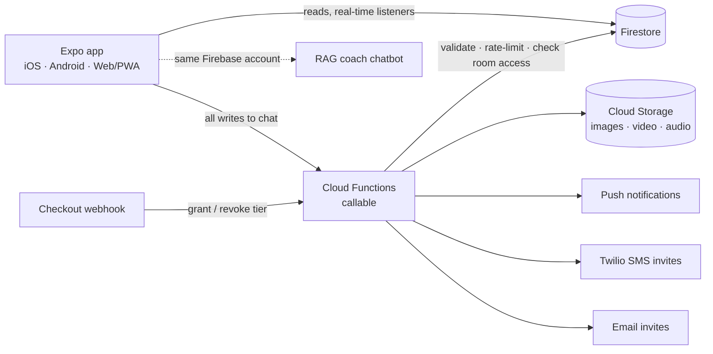

# Northstar Community App

A members-only community app for a paid coaching program: subscription-gated chat rooms, a resource library, a member "win wall" with weekly giveaways, and full admin tooling. It runs on iOS, Android and the web (as a PWA) from one Expo codebase, with a Firebase backend.

> **Portfolio version.** I built this for a real coaching business, where it hosted about 40 paying members and was built to scale past 200. The client's brand, logos, content and member data have been replaced with a fictional brand (*Northstar Coaching*) and placeholder art. The architecture and code are the production build.

## The problem

The coach was running her paid community across scattered group chats and links. She needed one private place where only paying members could get in, where different tiers saw different rooms, where she could post teachings and resources, and where she could moderate and manage members without a developer.

## Features

**Members**
- Real-time chat rooms gated by subscription tier or invite list
- Replies, reactions, @mentions, polls, pinned messages, message search, typing indicators and read receipts
- Images, video and voice notes
- Resource library of trainings, journal prompts, podcasts, audio and templates, organized by category and subcategory
- Win wall where members post wins, with a weekly raffle
- Push notifications, offline message cache, terms-acceptance gate, and self-service account deletion

**Admins**
- Member management: invite by email or SMS, grant or revoke tiers, remove members
- Per-room controls: lock chat, allowed speakers, invite lists
- Library publishing with file and audio uploads
- Moderation: reported messages and objectionable-content screening on new posts

## Architecture



- **Writes go through Cloud Functions, not the client.** Sending a message, image or video goes through a callable function that checks membership and per-room permissions, validates input, and applies rate limits. Firestore security rules back this up and block direct writes to sensitive fields such as role, tier and access flags.
- **Access model.** Community membership, subscription tier and status, and per-room invite lists together decide who can view and send in each room. The same rules gate the companion [RAG chatbot](../rag-coach-chatbot) through a shared Firebase login.
- **Payments.** A checkout-platform webhook grants or revokes tiers automatically when members subscribe, renew or cancel.
- **Web reliability.** The web build uses an in-memory Firestore cache and REST calls for critical reads. That fixed Safari hangs and stale-data bugs caused by IndexedDB persistence.

## Testing and CI

- 198 Jest unit tests for validators, formatters and accessibility helpers (color contrast, touch targets).
- GitHub Actions CI runs three required checks on every push: Cloud Functions build, app type-check, and tests.

## Stack

Expo (SDK 54) · React Native 0.81 · React 19 · Expo Router · TypeScript · Firebase (Auth, Firestore, Storage, Cloud Functions, Cloud Messaging) · Twilio · Vercel (web/PWA) · Jest · GitHub Actions

## Run it locally

```bash
npm install
cp .env.example .env              # your Firebase web config
npm run web                       # or: npm run ios / npm run android
```

To fill a **throwaway** demo Firebase project with fictional data (40 members, sample messages, and demo admin and member logins):

```bash
GOOGLE_APPLICATION_CREDENTIALS=./service-account.json DEMO_PASSWORD='choose-one' node scripts/seed-demo.js
```

Deploy the rules and functions with the Firebase CLI (`firebase deploy --only firestore:rules,storage,functions`).
